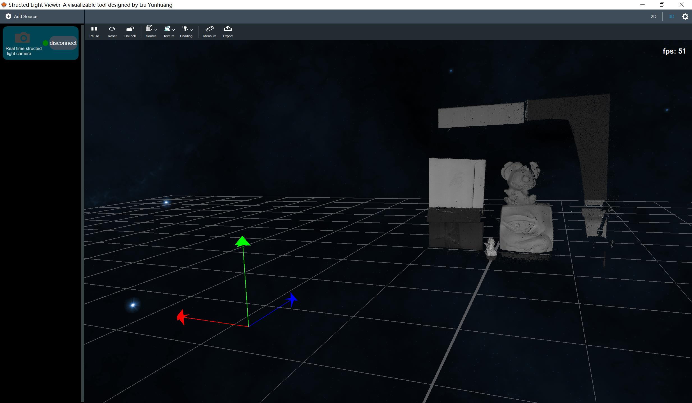

# 1.What is this
This is used for real time structed-light camera.

It based on OpenGL and QQuick.It is my first time to use QQuick,not bad,it looks well,but still not enough good.

# 2.How to use it
First,make sure you have installed these:

- StructedLightCamera[^1]
- OpenCV
- Eigen3
- Qt5
- CUDA

Notice that you need add defination `CUDA` for your code.

Our gui is looks like this:

Our system first to need to add Source and connect our realtime structedlight camera.then, it will perform in 3D mode.You can change to 2D mode to observe our depth map.Ofcause you can change our skybox in upper button.And some else function you can notice that.
Our system still has some fuction hasn't develope,yet some function I think it is not necessary.

- [ ] Measure
- [ ] Export
- [ ] Lock/Unlock

[^1]: my structedlight-camera SDK,see my repository.